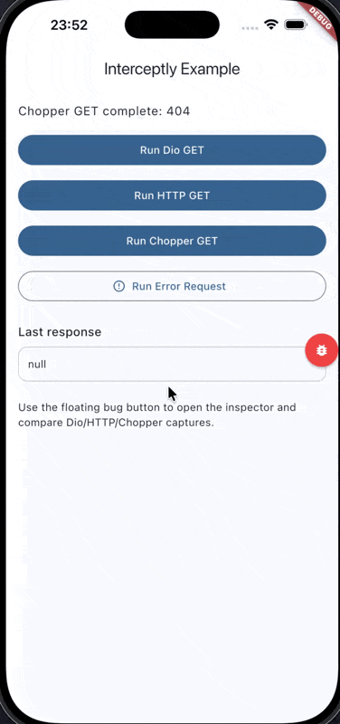
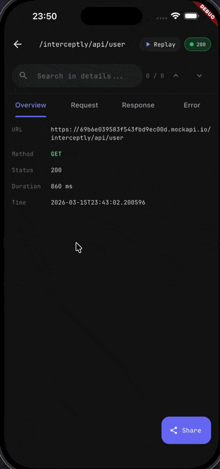

# Interceptly Example

This is an example Flutter application demonstrating the Interceptly network inspector with support for Dio, HTTP, and Chopper.

## Preview

| Inspector Overview | Request Details | Replay Tool |
| :---: | :---: | :---: |
|  |  |  |

## Features Demonstrated

- **Dio Integration**: Network traffic monitoring with Dio HTTP client
- **HTTP Integration**: Native HTTP client interception  
- **Chopper Integration**: Support for Chopper REST client
- **Floating Inspector**: Access the network inspector via floating button
- **Error Handling**: View and debug failed requests
- **Network Replay**: Modify and re-send intercepted requests

## Getting Started

1. Ensure you have Flutter installed: [Install Flutter](https://docs.flutter.dev/get-started/install)
2. Navigate to the example directory:
   ```bash
   cd example
   ```
3. Run the app:
   ```bash
   flutter run
   ```

## Usage

- Tap the **floating bug button** to open the Interceptly inspector
- Make network requests using the provided buttons
- View detailed request/response information
- Use the replay tool to modify and resend requests
- Check network simulation profiles

For more information, see the [main Interceptly documentation](../README.md).
